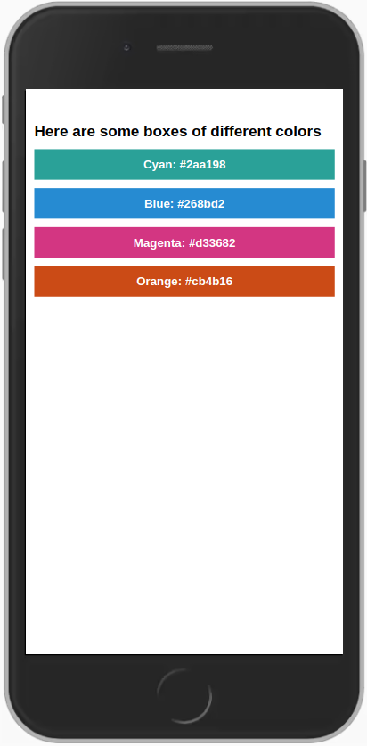

## First React Native interaction.

#### Building a screen to show Boxes with different colors:
 

#### This is the view rendered on an Iphone 7.
___
 

For this exercise, in our <code>App.js</code> main component, we are implementing following react native components:  
<pre>import { View, Text, SafeAreaView, StyleSheet } from "react-native";</pre>  

Also, we have created our first re-utilizable component <code> ./components/ColorBox.js</code> which has no childs inside, and therefore is handled with the following <b>props</b> and self closing tag structure:
<pre>
    &lt;ColorBox colorName="color-name" hexColor="#hexcolor" /&gt; (example)
</pre>

<!-- Social networks section -->

 
 
<table>
  <tr>
    <td>
      
    </td>
    <td>
      
    </td>
  </tr>
</table>

<h3>
  <b>👋 Hi, I'm Ronnie Barrios.
  </b>
</h3>
____________________________________
 
Let's get in touch !, scan QR code.
  

&emsp;

&emsp;

&emsp;
 
<a href="mailto:ronnie.coding@gmail.com?subject=Let's do a meet ! &amp;body=Hi Ronnie, %0D%0A%0D%0A I've check your Github profile, i would like to contact you.%0D%0A%0D%0A Att,%0D%0A------------------------%0D%0A***your sign*** &amp;">
 
--->&emsp;or Send EMAIL here&emsp;<---
</a>